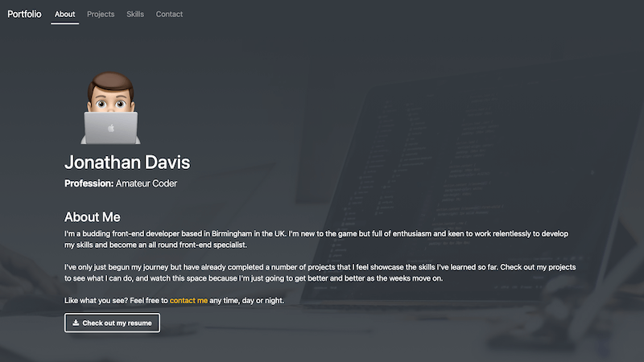
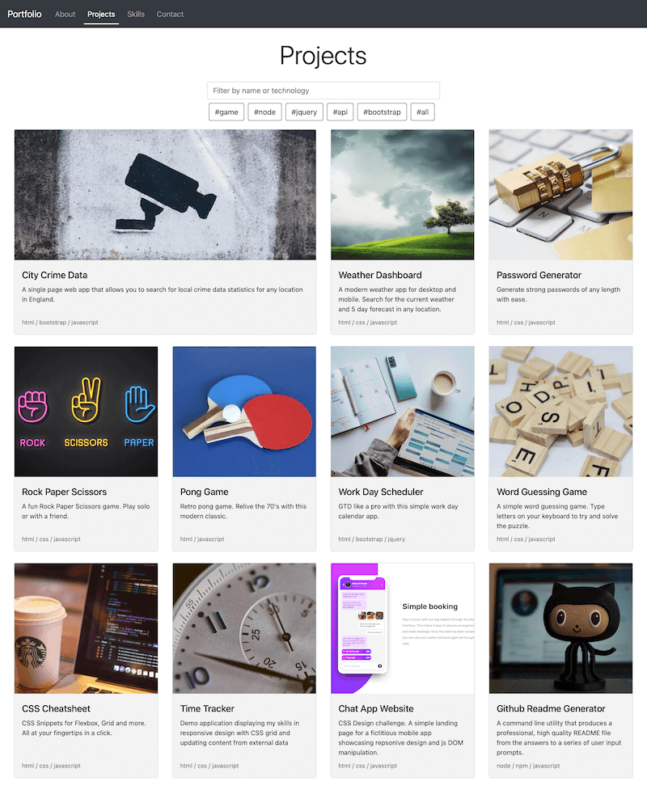
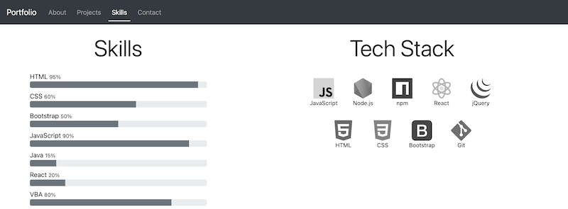
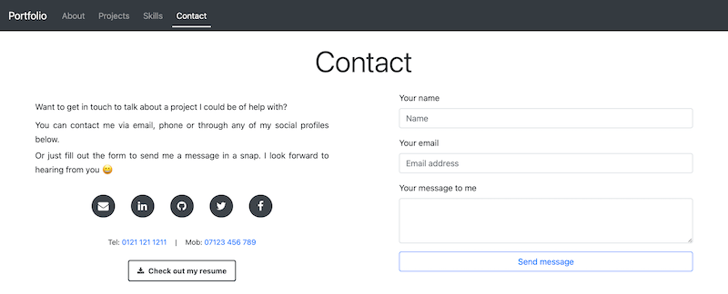

# React Portfolio

[Link to deployed site](https://trunten.github.io/ubbc-react-portfolio/)

## Description
- I was given the task of recreating my personal portfolio of work as a multi-page website using the [React](https://reactjs.org) framework.
- The site demonstrates my skills as a front-end developer and highlights my strongest work linking to deployed web applications.
- The site has been styled using [bootstrap](https://getbootstrap.com) with additional CSS styling overrides.
- The site has 4 distinct pages, with a navigation bar at the top of the page (collapses at smaller screen sizes) linking to each section. These sections are as follows:
  - About
  - Projects
  - Skills
  - Contact
- The about page contains a brief description about my life as a front-end devleoper and a donwload link to my CV
- The projects section contains titled images of my projects/applications with the first application's image displaying larger in size than the others.
- Buttons to the deployed application and github repo appear, overlayed on the project card's image, when the user hovers over a project card.
- When the buttons in the project cards are clicked the user is taken to that deployed application in a new browser tab/window (entire card is also clickable).
  - The projects page is also filterable through a search field and the top of the gallery
- The site is fully responsive and adapt to the user viewport, working equally well on desktop and mobile
- The skills page contains progress bars displaying the percentage of various coding languages that have been utilised in my projects that animate in on page load. In addition to those there are also skillls badges for my entire dev stack.

## Table of contents
- [Installation](#installation)
- [Usage](#usage)
- [Credits](#credits)
- [Contributing](#contributing)
- [Questions](#questions)
- [License](#license)

## Installation
- Installation is not required, but should you wish to work on the code base on your own machine run <code>npm i</code> in your terminal to install project dependancies

## Usage
- [Link to deployed site](https://trunten.github.io/ubbc-react-portfolio/)
- Jump to each page by clicking the links in the navigation bar
- Click on any of the buttons in the project cards (visbile on hover), or the project card itself to open up the deployed application in a new window/tab
- Contact me through email, phone or my social media profiles using the links provided on the contact page. Alternative send me a message using the built in form. 
- Download my cv using the links provided on the about and contact pages.
- Preview of the finished site:

 
 
 

## Credits
- Project images & jumbotron background: https://unsplash.com
- Rock Paper Scissors Image: Human Vectors by Vecteezy - https://www.vecteezy.com/free-vector/human
- Skill stack badges: flaticon.com

## Contributing
Pull requests are welcome. For major changes, please open an issue first to discuss what you would like to change.

This repo adopts the [Contributor Covenant](https://www.contributor-covenant.org/version/2/1/code_of_conduct/) for contributing guidlines.

## Questions
- Github Profile: [trunten](https://github.com/trunten)
- Contact me with any questions you may have via email at [trunten@btinternet.com](mailto:trunten@btinternet.com)

## License

This project is licensed under the [MIT License](https://choosealicense.com/licenses/mit/)

Refer to the [license](LICENSE) in the repo